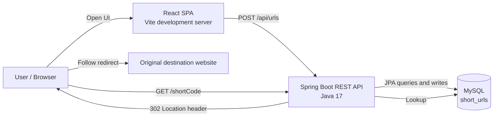
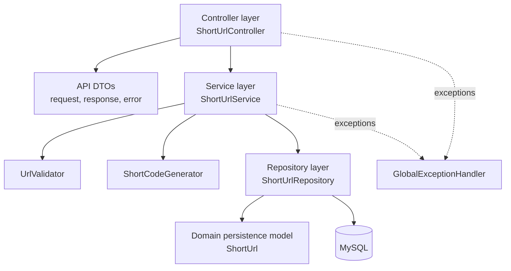
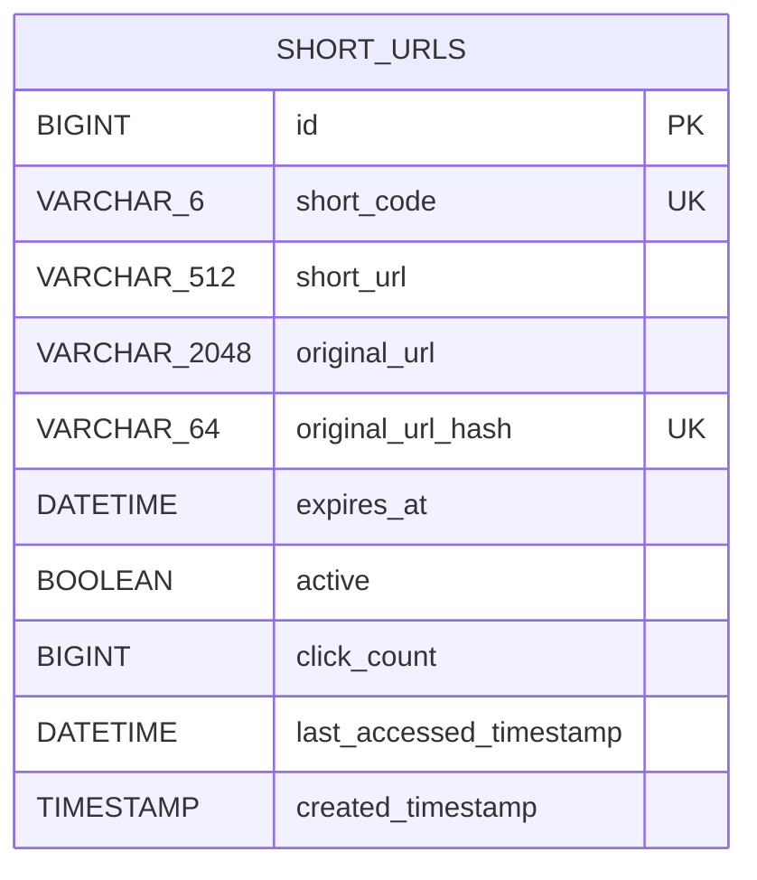
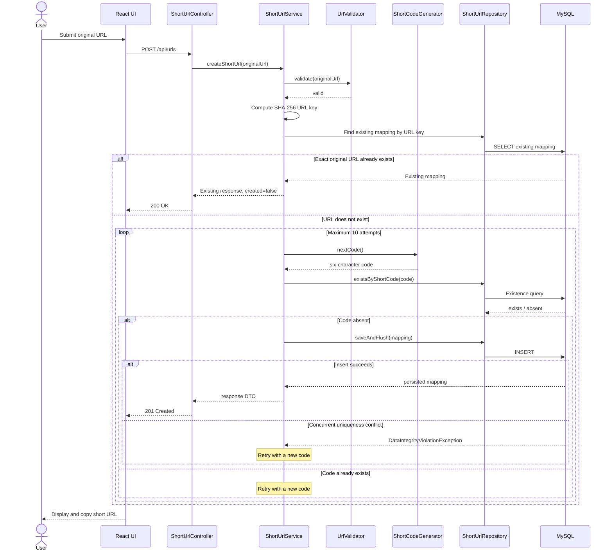
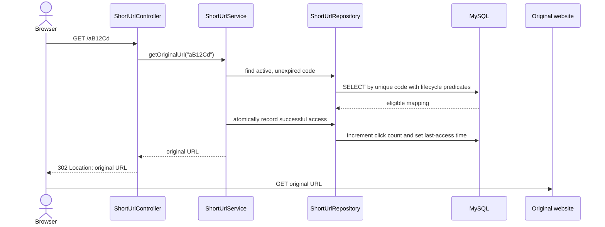

# URL Shortener System Design

## 1. Document purpose

This document describes the URL Shortener as implemented in this repository. It covers the current architecture, component responsibilities, data model, API contracts, runtime behavior, quality attributes, testing, deployment, and known limitations.

The companion [Architecture Decisions](ARCHITECTURE_DECISIONS.md) document records why the main technical choices were made and the tradeoffs they introduce.

## 2. Goals and scope

The system accepts an absolute HTTP or HTTPS URL, generates a secure six-character alphanumeric code, persists the mapping, and redirects visitors from the short URL to the original destination.

Implemented capabilities:

- Responsive React interface for submitting a long URL.
- REST endpoint for creating a short URL.
- Validation of absolute HTTP and HTTPS URLs.
- Reuse of an existing mapping when the exact original URL was previously shortened.
- Six-character Base62-style code generation with `SecureRandom`.
- Bounded short-code collision handling plus database uniqueness for codes and original URLs.
- MySQL persistence of the code, short URL, original URL, and UTC creation timestamp.
- HTTP 302 redirect when a short code is resolved.
- Consistent JSON error responses through global exception handling.
- Backend unit and integration tests using JUnit 5, Mockito, Spring Boot Test, MockMvc, and H2.

Out of scope in the current version:

- User accounts, authentication, or private links.
- Link expiration or deletion.
- Custom aliases.
- Click analytics.
- Malicious-destination reputation checks.
- Rate limiting and abuse prevention.
- Multi-region availability or a distributed cache.

## 3. System context



The frontend and backend are independently deployable. The backend is stateless with respect to application memory; MySQL is the system of record.

## 4. Technology stack

| Area | Current implementation | Responsibility |
|---|---|---|
| Frontend | React 18, JavaScript, Vite 8, CSS | Form handling, API calls, result display, copy interaction, responsive presentation |
| API | Java 17, Spring Boot 3.5, Spring Web | HTTP request handling, JSON serialization, redirect responses, CORS |
| Business layer | Spring services | URL validation, code generation workflow, collision retry, response construction |
| Persistence | Spring Data JPA, Hibernate | Entity mapping and repository access |
| Production database | MySQL | Durable URL mappings and uniqueness enforcement |
| Test database | H2 in MySQL compatibility mode | Isolated repeatable integration tests |
| Build | Maven and npm | Backend and frontend dependency/build lifecycles |
| Testing | JUnit 5, Mockito, Spring Boot Test, MockMvc | Unit and endpoint integration coverage |

## 5. Container and component design

### 5.1 Frontend

`frontend/src/App.jsx` owns the current UI state:

- `originalUrl`: value entered by the user.
- `isLoading`: prevents duplicate submissions and communicates progress.
- `result`: successful API response.
- `error`: API, validation, clipboard, or connectivity failure message.
- `copied`: temporary copy-button feedback.

The frontend reads `VITE_API_BASE_URL`, defaulting to `http://localhost:8080`. It sends JSON to `POST /api/urls`, displays the returned short URL as a link, and supports copying it to the clipboard.

`frontend/src/styles.css` supplies a responsive layout with a single-column mobile breakpoint at 620 pixels, keyboard focus states, and reduced-motion support.

### 5.2 Backend layers



#### Controller layer

`ShortUrlController` translates HTTP requests and responses. It does not contain validation, generation, persistence, or lookup business rules.

#### Service layer

`ShortUrlService` coordinates the application use cases:

- Validate the original URL.
- Generate and reserve a unique code.
- Build the public short URL.
- Save the entity and map it to an API response.
- Resolve a short code to an original URL.

#### Supporting domain services

- `UrlValidator` accepts only absolute `http` and `https` URIs with a host.
- `ShortCodeGenerator` uses `SecureRandom` and the alphabet `a-z`, `A-Z`, and `0-9`.
- `OriginalUrlHasher` creates the fixed-width SHA-256 key used to enforce original-URL uniqueness.

#### Repository layer

`ShortUrlRepository` extends `JpaRepository` and exposes:

- `existsByShortCode(String)` for the normal collision check.
- `findRedirectCandidate(String, Instant)` for active, unexpired redirect resolution.
- `recordSuccessfulAccess(Long, Instant)` for an atomic counter and last-access update.
- `saveAndFlush(ShortUrl)` through `JpaRepository` so uniqueness failures surface during the retry operation.

#### Cross-cutting components

- `GlobalExceptionHandler` converts application and framework exceptions to a consistent JSON format.
- `WebConfig` allows frontend POST requests from the configured origin.
- `UrlShortenerProperties` supplies the public base URL and allowed origin.
- `ApplicationConfig` supplies a UTC `Clock`, making timestamp behavior explicit and testable.

## 6. Data design

### 6.1 Entity relationship

The current model contains one independently stored entity and has no relationships.



### 6.2 Column definitions

| Column | Java type | Constraints | Purpose |
|---|---|---|---|
| `id` | `Long` | Primary key, identity generated | Internal database identity |
| `short_code` | `String` | Required, length 6, unique | Public lookup key |
| `short_url` | `String` | Required, maximum 512 | Complete public URL returned to clients |
| `original_url` | `String` | Required, maximum 2048 | Redirect destination |
| `original_url_hash` | `String` | SHA-256 hex, unique; nullable for legacy rows | Fixed-width uniqueness and indexed lookup key |
| `expires_at` | `Instant` | Required | UTC time one calendar month after creation |
| `active` | `boolean` | Required, defaults true | Administrative enable/disable state |
| `click_count` | `long` | Required, nonnegative, defaults zero | Count of successful redirect decisions |
| `last_accessed_timestamp` | `Instant` | Required | UTC time of creation or the most recent access |
| `created_timestamp` | `Instant` | Required, immutable after insert | Creation time in UTC |

The unique constraints on `short_code` and `original_url_hash` are the final authorities for uniqueness. The hash avoids an oversized MySQL index on the 2,048-character URL. The service confirms the original string after a hash lookup, so a theoretical hash collision cannot return the wrong mapping. Flyway owns runtime schema changes and Hibernate uses `ddl-auto: validate`.

## 7. API design

### 7.1 Create a short URL

`POST /api/urls`

Request:

```json
{
  "originalUrl": "https://www.example.com/products/category/item/12345"
}
```

Successful response for a new URL: `201 Created`

```json
{
  "shortCode": "aB12Cd",
  "shortUrl": "http://localhost:8080/aB12Cd",
  "originalUrl": "https://www.example.com/products/category/item/12345"
}
```

If the exact `originalUrl` already exists, the endpoint returns the same response body and stored short code with `200 OK`. URL matching is exact; the application does not canonicalize hostname case, query ordering, trailing slashes, or other semantically debatable URL variations.

For a new URL, `expires_at` is one UTC calendar month after `created_timestamp`, while `last_accessed_timestamp` initially equals `created_timestamp`. For an existing URL, the POST atomically increments `click_count` and refreshes `last_accessed_timestamp`.

### 7.2 Resolve a short URL

`GET /{shortCode}`

Successful response: `302 Found`

```http
Location: https://www.example.com/products/category/item/12345
```

The response body is empty. Browsers follow the `Location` header to the original destination.

### 7.3 Error contract

```json
{
  "code": "SHORT_URL_NOT_FOUND",
  "message": "Short URL was not found.",
  "timestamp": "2026-08-19T18:30:00Z"
}
```

| Condition | Status | Error code |
|---|---:|---|
| Invalid URL | 400 | `INVALID_URL` |
| Missing, blank, or malformed request | 400 | `INVALID_REQUEST` |
| Unknown short code | 404 | `SHORT_URL_NOT_FOUND` |
| Unique code cannot be obtained within the retry bound | 409 | `SHORT_CODE_CONFLICT` |
| Unhandled exception | 500 | `INTERNAL_SERVER_ERROR` |

## 8. Runtime behavior

### 8.1 Create flow



The code space contains `62^6`, or 56,800,235,584, possible values. The preliminary existence checks handle normal reuse and ordinary code collisions. Database constraints handle concurrent races between application instances: if another request inserts the same original URL first, the service reads and returns that winning mapping.

### 8.2 Redirect flow



If the repository returns no active and unexpired mapping, the service throws `ShortUrlNotFoundException`, which becomes a 404 JSON response. The metric update repeats the lifecycle predicates to prevent a redirect if state changes between lookup and update.

## 9. Configuration and deployment

### 9.1 Backend environment variables

| Variable | Default | Purpose |
|---|---|---|
| `DB_URL` | `jdbc:mysql://localhost:3306/url_shortener?...` | JDBC connection URL |
| `DB_USERNAME` | `root` | Database user |
| `DB_PASSWORD` | `password` | Local fallback only; override outside development |
| `APP_BASE_URL` | `http://localhost:8080` | Prefix used to construct stored short URLs |
| `APP_ALLOWED_ORIGIN` | `http://localhost:5173` | Permitted browser origin for API requests |

### 9.2 Frontend environment variables

| Variable | Default | Purpose |
|---|---|---|
| `VITE_API_BASE_URL` | `http://localhost:8080` | Backend API origin used by the browser |

The browser origin must exactly match `APP_ALLOWED_ORIGIN`. For the default configuration, open the UI at `http://localhost:5173`, not an alternate hostname.

### 9.3 Current local topology

```text
Browser  -> http://localhost:5173  React/Vite
React    -> http://localhost:8080  Spring Boot
Backend  -> localhost:3306         MySQL / url_shortener
```

For production, terminate TLS at a reverse proxy or load balancer, use a managed secret source, set a stable public `APP_BASE_URL`, and replace automatic schema updates with versioned migrations.

## 10. Quality attributes

### Security

- `SecureRandom` makes generated codes impractical to predict sequentially.
- URL validation restricts destinations to HTTP and HTTPS.
- Spring Data generates parameterized database access.
- API DTOs prevent direct entity binding.
- Error responses hide internal stack traces from clients.
- Secrets are supplied through environment variables and are not stored in source control.

Current gaps for an internet-facing deployment include rate limiting, abuse detection, destination reputation checks, security headers, and HTTPS enforcement.

### Reliability and consistency

- Database uniqueness guarantees that one stored code cannot represent two mappings and that one original URL hash cannot create duplicate mappings.
- Bounded retries prevent an infinite loop during repeated collisions.
- UTC `Instant` values avoid server-time-zone ambiguity.
- The application is stateless outside MySQL and can be horizontally replicated against the same database.

### Performance and scalability

- Redirect resolution is a single indexed lookup by unique code.
- Creation requires an existence query and an insert in the usual case.
- The 56.8-billion-value code space is sufficient for the current scope, but collision probability grows with the number of records.
- A future high-read deployment can add a cache in front of MySQL without changing the public API.

### Maintainability

- HTTP, business, generation, validation, and persistence concerns are separated.
- Constructor injection makes dependencies explicit.
- Configuration is externalized.
- Unit tests isolate business branches while integration tests verify routing, serialization, persistence, and redirects together.

## 11. Test design

The backend currently has 19 passing tests.

| Test area | Coverage |
|---|---|
| Generator unit tests | Six-character alphanumeric format and varied output |
| Service unit tests | Successful creation, existing-URL reuse, invalid URL, database lookup, missing code, normal collision, concurrent code collision, concurrent original-URL insertion, bounded retry failure |
| API integration tests | New and repeated POST, invalid POST, redirect with metric update, inactive/expired link rejection, unknown-code 404 |

Integration tests run with the `test` profile and an in-memory H2 database configured in MySQL compatibility mode. The code generator is overridden in endpoint tests so assertions remain deterministic.

The frontend currently has build verification but no automated component or browser tests.

## 12. Known limitations and technical debt

- Unsupported routes such as browsing `GET /api/urls` currently fall through the generic exception handler and may appear as a 500 instead of a more precise 404 or 405.
- `ddl-auto: update` is convenient locally but does not provide reviewed, repeatable production migrations.
- Storing the complete `short_url` means existing rows retain an old hostname if `APP_BASE_URL` changes.
- There is no input length rule before the 2048-character database limit is reached.
- There is no code expiration, soft deletion, ownership, analytics, or administrative API.
- A single configured CORS origin is supported.
- There are no readiness, liveness, metrics, or tracing endpoints.
- MySQL collation should be explicitly reviewed for case-sensitive Base62 code behavior in a production schema.
- The frontend has no automated test suite.

## 13. Recommended evolution

### Near term

1. Handle unsupported methods and missing routes explicitly as 404/405.
2. Add request length validation and corresponding tests.
3. Add an administrative API for expiration and active-state management.
4. Add Spring Boot Actuator health and metrics endpoints.
5. Add frontend unit tests and one browser-level create/redirect test.

### Before public internet exposure

1. Add rate limiting and request-size limits.
2. Add malicious-link and blocked-domain controls.
3. Require HTTPS and configure trusted proxy headers.
4. Use a dedicated least-privilege database user and managed secrets.
5. Add structured request logging, metrics, alerting, and audit events.

### At larger scale

1. Cache popular code lookups.
2. Add read replicas if database reads become the bottleneck.
3. Consider a longer code or a coordinated ID-to-code scheme as the stored population approaches the practical limit for six characters.
4. Separate analytics ingestion from the redirect request path.
