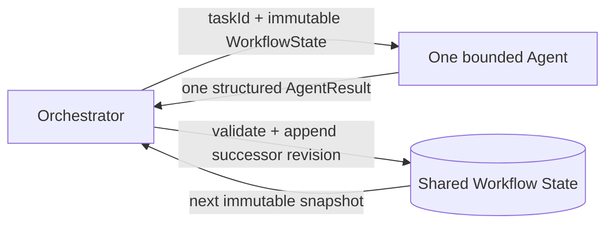

# Agent Definition Contracts

## Purpose

This document defines the Agent Definition layer for the URL Shortener SDLC orchestrator. The layer establishes role contracts and autonomy boundaries only. It does not contain LLM calls, workflow scheduling, state persistence, application behavior, or deployment logic.

The canonical durable state remains [`orchestrator/state/workflow-state.schema.json`](../orchestrator/state/workflow-state.schema.json), and the authoritative workflow remains [`orchestrator/workflow/README.md`](../orchestrator/workflow/README.md). `WorkflowState.java` is an immutable agent-facing projection that a future persistence adapter must map to and from that schema.

Risk-based execution is governed by the [controlled-autonomy policy](../orchestrator/policies/controlled-autonomy-policy.md). The orchestrator must evaluate one intended operation before invoking an operational agent and validate its result before accepting a successful state transition.

## Communication model

Agents never call each other. They do not schedule DAG nodes or mutate/persist `WorkflowState`. The orchestrator selects one agent for one task, supplies an immutable state snapshot, validates its `AgentResult`, and alone decides whether to append a successor state revision. This prevents hidden side channels and keeps resumption, audit, retries, approvals, and dynamic replanning centralized.

For bounded implementation correction, the [retry orchestrator](../orchestrator/workflow/implementation-retry.md) passes an optional `WorkflowState.RetryContext` containing the previous same-task failure. The agent may use that context only for targeted correction; it cannot decide whether or how many times to retry.

Rollback is likewise controlled by the [rollback orchestrator](../orchestrator/workflow/rollback-handling.md). Agents may produce rollback proposals and evidence, but only the orchestrator may authorize and invoke a rollback adapter after checkpoint verification and exact human approval.

The public [`AgentCatalog`](../orchestrator/agents/AgentCatalog.java) exposes the concrete agents through the [`Agent`](../orchestrator/agents/Agent.java) interface. Concrete role classes are package-private because the requested snake-case filenames do not match Java public-class filename rules.

## Common contracts

`Agent.execute(String taskId, WorkflowState workflowState)` processes exactly one assigned task. `AbstractAgent` validates the workflow/task status, stage, assignment, retry bound, required context, dependency status/artifacts, input artifacts, and human approvals before role behavior can run.

`AgentResult` always contains:

| Field | Meaning |
|---|---|
| `agentName`, `taskId`, `status`, `summary` | Invocation identity and factual outcome |
| `artifacts` | References to new versioned outputs; no hidden payload channel |
| `decisions` | Decisions with rationale |
| `risks` | New or updated risks |
| `validationResults` | Checks performed and evidence references |
| `requiresHumanApproval` | Explicit request for the orchestrator to pause at a gate |
| `error` | Structured error code/message/retryability/details |
| `startedAt`, `completedAt` | UTC audit timestamps |

Every definition records the following audit fields: workflow/requirement/task-graph versions; before/after state revisions; agent and task identity; attempt; input/output artifact IDs; decisions; risks; validations; approval references; error; and start/completion timestamps. The agent returns its part of this evidence; the orchestrator owns the durable audit append.

All possible actions are classified as allowed, approval-controlled, or prohibited. No agent may orchestrate the workflow, approve requirements/design/release, deploy, or execute rollback. Waivers are never self-approved. A current task-scoped human approval is required before an approval-controlled action can execute.

The centralized policy adds risk context to that role boundary: low risk may execute autonomously, medium risk may execute only with validation evidence, and high risk requires an exact task/action-scoped human approval. Agent prohibitions always win; an approval cannot grant a capability the agent does not own.

The orchestrator owns the high-risk human interaction through `orchestrator/policies/HumanApprovalInteraction.java`. Agents may report `requiresHumanApproval` and describe a proposed change, but they cannot treat a human response as approved, create their own approval record, or continue execution. `Y` records scoped approval for policy re-evaluation, `N` pauses and blocks the task, and `M` invalidates the task for replanning. The complete contract is in [controlled-autonomy-policy.md](../orchestrator/policies/controlled-autonomy-policy.md).

Operational execution is intentionally absent. After contract validation, every agent currently returns `BLOCKED` with `EXECUTION_NOT_IMPLEMENTED`.

## Agent responsibilities and boundaries

| Agent | Required workflow context | Allowed responsibility | Approval-controlled actions | Not allowed (notable examples) | Primary output |
|---|---|---|---|---|---|
| `RequirementAgent` | Requirements | Normalize requirements; identify ambiguity/assumptions; define acceptance criteria; record risks | None | Architecture, planning, code, tests, approvals | Normalized requirements, ambiguities, assumptions, acceptance criteria |
| `PlanningAgent` | Requirements | Decompose tasks; dependencies; parallel sequence; retry policy; risks | None | Architecture, implementation, testing, design approval | Versioned task graph and execution plan |
| `ArchitectureAgent` | Requirements | Components/interfaces/data flow; ADRs; security boundaries; rollback proposals; risks | None (it may propose high-impact changes, never enact them) | Code/schema/API modification, testing, approval | Architecture, decisions, rollback strategy |
| `ImplementationAgent` | Requirements, task graph, architecture, approvals, rollback | Smallest approved source/configuration change; validated patch dependency upgrades; changed-file and validation obligations | New/non-patch dependencies, authentication/security, public API, and database schema changes | File deletion, tests/docs, requirement/design changes, deployment | Changed files and implementation artifact |
| `TestAgent` | Task graph, implementation changes | Test-only changes; unit/integration execution; actual evidence | None | Production changes, fabricated passes, waivers | Test changes and actual run results |
| `ValidationAgent` | Requirements, task graph | Security/acceptance/quality evidence evaluation; risks | None | Evidence modification, waivers, gate approval | Criterion results and non-binding recommendation |
| `DocumentationAgent` | Requirements, implementation changes | Accurate documentation updates and documentation risks | None | Source/test/config/design changes, invented behavior | Documentation artifacts and limitations |
| `ReleaseReadinessAgent` | Requirements, graph, implementation, tests, validation, docs, risks, approvals, rollback | Release manifest and readiness assessment | None | Deployment, release approval, risk acceptance, waiver, rollback | Manifest, recommendation, residual risks |

### Validation, failure, and human gates

| Agent | Validation focus | Fails/blocks when | Requires human approval when |
|---|---|---|---|
| Requirement | Provenance, explicit assumptions, traceable/testable criteria | Missing/contradictory/stale source or unsafe ambiguity | An assumption changes material scope/security/data/public contract; requirement baseline gate |
| Planning | Acyclic graph, ownership, evidence, bounded retries | Cycle, unsatisfied dependency, ownerless task, stale requirement | Scope expands/high-impact work appears; design gate |
| Architecture | Traceability, interfaces, failure/security/rollback completeness | Constraint conflict or critical security/rollback gap | Public API/schema/trust-boundary/irreversible proposal; design gate |
| Implementation | Current approvals/checkpoint, in-scope files, downstream validation | Missing/stale prerequisite, scope escape, prohibited action, exhausted retries | New/non-patch dependency, API/schema, authentication/security, data-loss, destructive, or scope-expanding change |
| Test | Traceability and actually executed reproducible commands | Missing environment/evidence, failure/error/timeout, production change required | Production/shared data, material cost, destructive setup, or requested waiver |
| Validation | Same-revision evidence and explicit criterion results | Missing/stale/failed evidence or unapproved critical/high finding | Any waiver and quality/human gate decision |
| Documentation | Traceability and factual accuracy | Stale/inconsistent implementation or behavioral invention required | Sensitive publication or externally committed documentation contract change |
| Release readiness | Same-revision complete evidence and rollback package | Missing/mixed/failed evidence or unapproved residual risk | Release decision, deployment, waiver, risk acceptance, or rollback action |

The detailed executable rule lists and exhaustive action classifications live in each agent's `AgentDefinition`; the paired prompt restates the same boundary for a future LLM adapter.

## File and prompt mapping

| Java definition | Prompt | Runtime name |
|---|---|---|
| `requirement_agent.java` | `requirement-agent.md` | `RequirementAgent` |
| `planner_agent.java` | `planner-agent.md` | `PlanningAgent` |
| `architecture_agent.java` | `architecture-agent.md` | `ArchitectureAgent` |
| `implementation_agent.java` | `implementation-agent.md` | `ImplementationAgent` |
| `test_agent.java` | `test-agent.md` | `TestAgent` |
| `validation_agent.java` | `validation-agent.md` | `ValidationAgent` |
| `documentation_agent.java` | `documentation-agent.md` | `DocumentationAgent` |
| `release_agent.java` | `release-agent.md` | `ReleaseReadinessAgent` |

The existing DAG uses the older labels `PlannerAgent` and `ReleaseAgent`. The new contract follows the requested names `PlanningAgent` and `ReleaseReadinessAgent`; a future orchestrator integration must update the DAG labels or provide explicit aliases as one coordinated change.

## Deferred implementation

- JSON serialization and validation between the canonical state schema and `WorkflowState`
- Prompt loading, version/hash capture, model selection, LLM API adapter, and structured-output parsing
- Role-specific deterministic/LLM `performTask` implementations and tool sandboxes
- General DAG scheduling, state compare-and-swap persistence, leases, checkpoint creation, and replanning. Retry and rollback coordinators now exist, but destructive Git/database adapters and durable runtime wiring remain intentionally absent.
- Policy engine for gates, action authorization, approval scope/expiry, and security waivers
- Artifact repository, audit sink, metrics/tracing, secrets controls, and prompt-injection defenses
- Spring Boot wiring or a separate orchestrator runtime module
- Coordinated DAG owner-label rename/alias noted above
