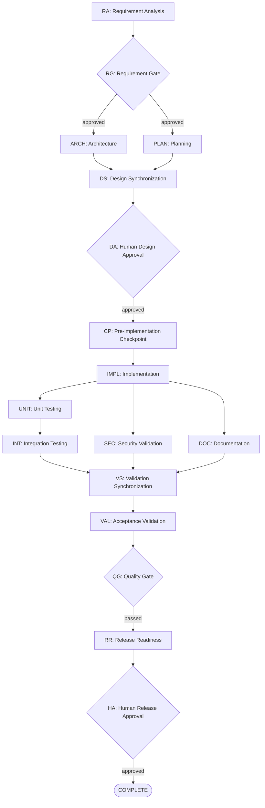
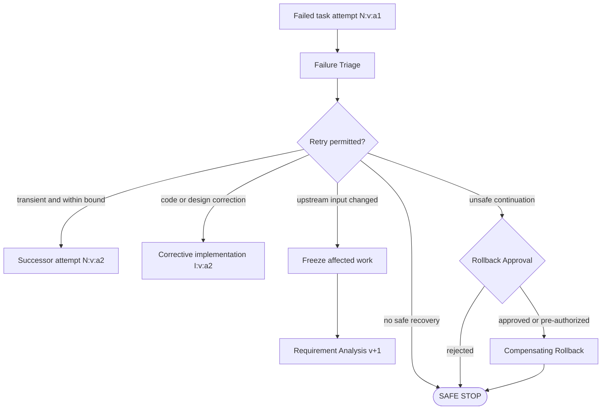

# Agentic SDLC Workflow DAG

## 1. Purpose and scope

This document defines the explicit Directed Acyclic Graph used to coordinate an agentic software-delivery lifecycle across:

- Requirement analysis
- Architecture
- Planning
- Implementation
- Unit testing
- Integration testing
- Security validation
- Documentation
- Acceptance validation
- Release readiness

The workflow is a design contract, not an executable engine. Agent names describe intended task ownership and do not imply that agent implementations currently exist.

Durable runtime state for this graph must conform to the companion [workflow state schema](../state/workflow-state.schema.json). Resumption, idempotency, dynamic replanning, and cross-record invariants are described in the [shared-state rationale](../state/README.md).

### Workflow at a glance

This compact view is a reading aid. The detailed DAG, gate rules, and recovery transitions later in this document remain authoritative.



Figure files: [Mermaid source](sdlc-workflow.mmd) · [SVG](sdlc-workflow.svg) · [PNG](sdlc-workflow.png)

Legend: blue nodes perform work, yellow diamonds are gates, purple circles synchronize parallel branches, and green is the successful terminal state. Failure, retry, rollback, safe-stop, and dynamic-replanning paths are shown in the recovery sections below.

## 2. Design principles

1. Every execution task has a stable ID, requirement version, plan version, bounded attempt count, and idempotency key.
2. Architecture and planning run in parallel after requirement approval.
3. Unit testing, security validation, and documentation run in parallel after implementation.
4. Synchronization nodes reject mixed requirement, plan, implementation, or artifact versions.
5. Human approval is mandatory before implementation and before declaring the workflow complete.
6. Failures never create backward graph edges. Retries and replans create versioned successor nodes.
7. Completed history is invalidated or superseded, never silently overwritten.
8. Unsafe, unauthorized, or exhausted execution transitions to `SAFE_STOPPED`.

## 3. Primary DAG



### 3.1 Parallel paths

- `ARCH` and `PLAN` may execute concurrently after `RG` passes.
- `UNIT`, `SEC`, and `DOC` may execute concurrently after `IMPL` succeeds.
- `INT` may begin after `UNIT` succeeds while `SEC` and `DOC` continue independently.

### 3.2 Synchronization points

- `DS` joins architecture and planning. Both inputs must reference the same requirement version.
- `VS` joins integration-test, security-validation, and documentation outputs. All inputs must reference the same implementation and plan versions.
- Changing any joined input invalidates the synchronization result and all affected downstream nodes.

## 4. Recovery expansion

Retries, corrective work, replanning, and rollback are represented as new forward nodes.



`N:v:a2` means task `N`, plan version `v`, attempt 2. It is a successor node with a forward dependency on the failed attempt. It is not a return edge to the original task, so the execution graph remains acyclic.

## 5. Node descriptions

| ID | Stage | Intended owner | Entry conditions | Exit conditions |
|---|---|---|---|---|
| `RA` | Requirement analysis | `RequirementAgent` | Source requirement exists and has a recorded version and hash. | Normalized requirements, assumptions, ambiguities, acceptance criteria, risks, and traceability artifact exist. |
| `RG` | Requirement gate | Policy engine and human reviewer when required | `RA` completed and its artifact is structurally valid. | Requirements are approved, or approved assumptions resolve all blocking ambiguity. |
| `ARCH` | Architecture | `ArchitectureAgent` | `RG` passed; approved requirement version is available. | Components, interfaces, data flow, security boundaries, failure handling, and architecture decisions are documented. |
| `PLAN` | Planning | `PlannerAgent` | `RG` passed; approved requirement version is available. | Tasks, dependencies, parallel paths, sequencing, validation obligations, and ownership are defined. |
| `DS` | Design synchronization | Orchestrator | `ARCH` and `PLAN` completed for the same requirement version. | Architecture and plan agree on scope, interfaces, dependencies, affected files, tests, and rollout order. |
| `DA` | Design approval | Human reviewer | `DS` passed; high-impact changes and rollback strategy are identified. | An authorized human approves the design and implementation scope. |
| `CP` | Pre-implementation checkpoint | Orchestrator | `DA` is approved and no upstream artifact is stale. | Durable state snapshot, file hashes, artifact hashes, and rollback baseline are recorded. |
| `IMPL` | Implementation | `ImplementationAgent` | `CP` exists; approval remains valid; dependencies are current. | The smallest coherent change is complete and all changed files and artifacts are recorded. |
| `UNIT` | Unit testing | `TestAgent` | Relevant implementation outputs exist. | Required unit tests were actually executed and results were recorded. |
| `SEC` | Security validation | `ValidationAgent` or security specialist | Implementation outputs and architecture security boundaries exist. | Security checks completed with no unapproved critical or high findings. |
| `DOC` | Documentation | `DocumentationAgent` | Implemented behavior and approved requirements are available. | User, API, architecture, operations, and change documentation match the implementation. |
| `INT` | Integration testing | `TestAgent` | `UNIT` passed and required infrastructure is available. | Integration contracts, database behavior, and component interactions pass. |
| `VS` | Validation synchronization | Orchestrator | `INT`, `SEC`, and `DOC` completed for the same implementation revision. | Evidence is complete, internally consistent, and contains no stale artifact. |
| `VAL` | Acceptance validation | `ValidationAgent` | `VS` passed. | Each approved acceptance criterion is passed, failed, waived, or explicitly unresolved. |
| `QG` | Quality gate | Policy engine | `VAL` completed with test, security, risk, and documentation evidence. | Quality policy passes or an authorized, scoped waiver is recorded. |
| `RR` | Release readiness | `ReleaseAgent` | `QG` passed. | Release manifest, version, configuration, residual risks, rollback plan, and evidence package are complete. |
| `HA` | Human release approval | Human release owner | `RR` completed and its evidence has not changed. | Authorized human approves or rejects release readiness. |
| `COMPLETE` | Terminal state | Orchestrator | `HA` approved. | Workflow is immutable except for append-only audit annotations. |

## 6. Dependencies

| From | To | Required dependency or artifact |
|---|---|---|
| `RA` | `RG` | Normalized requirement artifact |
| `RG` | `ARCH` | Approved requirement version |
| `RG` | `PLAN` | Approved requirement version |
| `ARCH` | `DS` | Architecture artifact and decisions |
| `PLAN` | `DS` | Task graph and delivery plan |
| `DS` | `DA` | Reconciled design package |
| `DA` | `CP` | Human design approval |
| `CP` | `IMPL` | Durable rollback baseline |
| `IMPL` | `UNIT` | Changed production units |
| `IMPL` | `SEC` | Changed code, dependencies, configuration, and threat boundaries |
| `IMPL` | `DOC` | Implemented behavior and changed-file list |
| `UNIT` | `INT` | Passing unit-test evidence |
| `INT` | `VS` | Integration-test report |
| `SEC` | `VS` | Security-validation report |
| `DOC` | `VS` | Current documentation artifacts |
| `VS` | `VAL` | Synchronized evidence package |
| `VAL` | `QG` | Acceptance-validation result |
| `QG` | `RR` | Quality-gate decision |
| `RR` | `HA` | Release-readiness package |
| `HA` | `COMPLETE` | Human approval record |

## 7. Gate conditions

### 7.1 Requirement gate

The requirement gate must confirm:

- Requirement source, version, and content hash are recorded.
- Functional and non-functional requirements are separated.
- Acceptance criteria are testable.
- Assumptions are explicitly labeled.
- Blocking ambiguities are resolved or escalated.
- Security, compliance, data, API, and schema implications are identified.
- No high-impact ambiguity has been silently resolved.

Human approval is required when ambiguity affects:

- Public APIs
- Database schemas, destructive migrations, or data retention
- Authentication or authorization
- Security or compliance policy
- Production deployment
- Irreversible actions
- Material cost, scope, or schedule commitments

### 7.2 Design approval

The design gate must confirm:

- Architecture and plan use the same requirement version.
- Interfaces and affected modules are identified.
- Database and public API changes are explicitly disclosed.
- Test strategy covers the changed behavior.
- Security risks and controls are documented.
- Rollback feasibility is documented.
- Agent autonomy boundaries and tool permissions are defined.
- No unresolved critical risk exists.

This is a mandatory human gate.

### 7.3 Quality gate

The quality gate must confirm:

- All required tests were actually executed.
- Unit and integration tests pass.
- Security validation has no unapproved critical or high findings.
- Acceptance criteria have evidence.
- Documentation reflects implemented behavior.
- No required artifact is stale.
- Retry and failure records are complete.
- Changed files remain within approved scope.
- Rollback information is current.

A waiver must record scope, rationale, approver, expiry, and residual risk. Security or compliance waivers require an authorized security or compliance owner.

### 7.4 Human release approval

The release owner must confirm:

- The quality gate passed.
- Release contents and version are known.
- Residual risks are accepted.
- Rollback actions are executable and scoped.
- Configuration and secrets are not embedded in artifacts.
- No requirement, code, test, documentation, or state input changed after quality validation.

Any material post-gate change invalidates this approval.

## 8. Retry rules

| Failure type | Retry rule | Bound |
|---|---|---:|
| Requirement parsing or tool failure | Retry only when transient; ambiguity is not retried. | 1 retry |
| Architecture generation failure | Retry after failure classification or corrected input. | 2 total attempts |
| Planning failure | Retry after dependency or scope correction. | 2 total attempts |
| Implementation tool or transient failure | Resume from checkpoint with the same idempotency key. | 2 retries |
| Deterministic implementation defect | Create a corrective implementation successor node. | 2 corrective iterations |
| Unit or integration test infrastructure failure | One unchanged rerun may distinguish a transient failure from a defect. | 1 rerun |
| Deterministic test failure | Do not blindly rerun; create corrective implementation and replacement test nodes. | Within 2 corrective iterations |
| Security tool failure | Retry only for tool or infrastructure failure. | 2 total attempts |
| Security finding | Remediate or obtain an approved waiver; rerunning the same scan is not remediation. | No blind retry |
| Documentation generation failure | Retry after resolving the tool or input issue. | 2 total attempts |
| Acceptance-validation failure | Replan or correct the responsible upstream artifact. | Within corrective budget |
| Approval rejection or expiry | Never retry automatically. | Human action required |
| Policy violation | Never bypass by retry. | Escalate or safe-stop |
| Rollback failure | Resume only an idempotent rollback action when safe. | 2 total attempts |

Each attempt must record:

- Attempt number
- Failure category and retriable classification
- Retry strategy and delay
- Requirement, plan, input, and artifact versions
- Start and completion timestamps
- Result
- Idempotency key

The implementation workflow permits an initial implementation plus no more than two corrective implementation iterations. Exhausting that budget requires safe-stop or explicit human authorization of a new plan version.

## 9. Failure transitions

| Failed node | Transition |
|---|---|
| `RA` | Retry a transient tool failure; otherwise wait for clarification or safe-stop. |
| `RG` | Rejected requirements become `SAFE_STOPPED`, `CANCELLED`, or requirement version `v+1`. |
| `ARCH` | Retry corrected architecture; trigger requirement version `v+1` if the requirement is defective. |
| `PLAN` | Retry a corrected plan; invalidate `DS` when architecture and plan conflict. |
| `DS` | Create versioned `ARCH` and/or `PLAN` successors for conflicting inputs. |
| `DA` | Rejection creates a new design/plan version or safe-stops; implementation cannot begin. |
| `CP` | Safe-stop because implementation cannot begin without a durable recovery point. |
| `IMPL` | Classify the failure, restore the checkpoint when necessary, and create a bounded successor attempt. |
| `UNIT` | Rerun one transient failure; deterministic failure creates a corrective implementation successor. |
| `INT` | Diagnose contract, data, or environment failure and create only affected corrective successors. |
| `SEC` | A critical finding blocks progress; remediate, obtain an authorized waiver, or safe-stop. |
| `DOC` | Retry documentation or invalidate it when implementation changes. |
| `VS` | Inconsistent versions invalidate stale branches and trigger selective regeneration. |
| `VAL` | Map failed criteria to their producing tasks and selectively replan. |
| `QG` | Block release readiness; waive only through an authorized and audited human decision. |
| `RR` | Correct the release manifest, configuration, documentation, or rollback evidence and rerun affected gates. |
| `HA` | Rejection safe-stops release or creates an approved replan; it never transitions to complete. |
| Rollback | Retry only idempotent actions; otherwise safe-stop and escalate. |

## 10. Dynamic replanning

If a requirement changes during any stage, the orchestrator must:

1. Record immutable requirement version `v+1`.
2. Move the workflow to `REPLANNING`.
3. Stop issuing new work from the old plan.
4. Allow already-running tasks to finish only when safe; otherwise cancel them.
5. Traverse dependency edges from the changed requirement or artifact.
6. Mark affected completed nodes `INVALIDATED`.
7. Mark affected output artifacts `STALE`.
8. Preserve completed nodes whose inputs, decisions, and policies are unchanged.
9. Create task-graph version `p+1` with successor task IDs.
10. Record added, invalidated, preserved, and stale entities in `replanHistory`.
11. Re-run the requirement gate.
12. Renew design and release approvals when approved scope changed.
13. Resume only from a new durable checkpoint.

Successor nodes may reference invalidated predecessors for historical lineage, but invalidated nodes never satisfy execution dependencies. This keeps every active graph version acyclic.

## 11. Rollback path

A checkpoint is mandatory immediately after design approval and before implementation.

Rollback may be triggered when:

- Corrective attempts are exhausted.
- Validation reveals unsafe partial changes.
- A schema, deployment, data, or file change cannot proceed safely.
- Human approval is revoked after implementation.
- The quality or release gate identifies an unrecoverable state.

```text
Failure
  ↓
Failure Triage
  ↓
Rollback Scope Validation
  ↓
Human Approval, if destructive or externally visible
  ↓
Idempotent Compensating Actions
  ↓
Rollback Validation
  ↓
SAFE_STOPPED or Requirement/Plan v+1
```

Rollback does not automatically authorize continued execution. After rollback validation, the workflow remains safe-stopped unless an approved replan explicitly authorizes new work.

## 12. Safe-stop behavior

Entering `SAFE_STOPPED` must:

1. Stop scheduling new tasks.
2. Revoke or allow active leases to expire according to policy.
3. Prevent pending approvals from being reused.
4. Preserve workspace and artifact evidence.
5. Record the failure, retry exhaustion, policy, or approval reason.
6. Record whether rollback was attempted and its outcome.
7. Create a durable checkpoint and audit event.
8. Identify the human role required to resume or replan.

Safe-stop is required when:

- Retry or corrective-iteration bounds are exhausted.
- No safe rollback or fallback exists.
- A required approval is rejected, revoked, or unavailable.
- A security or compliance policy blocks continued work.
- Workflow state, audit lineage, or artifact integrity cannot be verified.
- Resumption could repeat an unverified external side effect.

## 13. Human-approval matrix

| Action | Approval requirement |
|---|---|
| Approve normalized requirements | Conditional; mandatory for high-impact ambiguity |
| Approve architecture and implementation plan | Mandatory |
| Change a public API | Mandatory |
| Change a database schema or data-retention behavior | Mandatory |
| Execute a destructive or externally visible rollback | Mandatory unless a pre-authorized runbook exactly covers it |
| Waive a failed quality criterion | Mandatory and scoped |
| Waive a security or compliance finding | Mandatory from the authorized security/compliance owner |
| Approve release readiness | Mandatory |
| Resume from `SAFE_STOPPED` | Mandatory with a new checkpoint or plan version |

Approval applies only to the recorded requirement version, plan version, artifacts, tasks, and action scope. A materially changed replan requires renewed approval.
