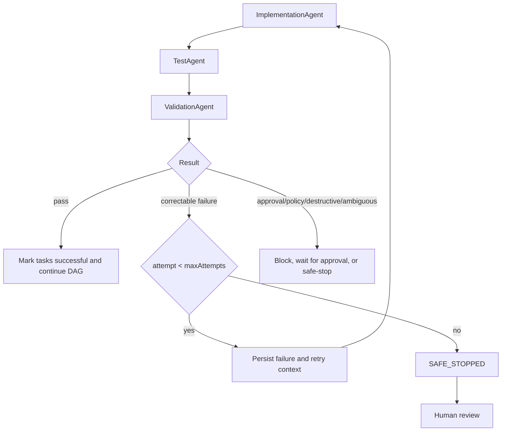

# Bounded Implementation Retry

## Scope

`ImplementationRetryOrchestrator` owns the corrective cycle for one approved implementation task and its linked test and validation tasks:



No agent contains a retry loop or chooses its retry count. Each stage executes once per orchestrator invocation. A corrective retry always uses the same implementation task ID and reruns implementation, test, and validation.

## Configuration

[`retry-config.yaml`](retry-config.yaml):

```yaml
retry:
  implementation:
    # Total attempts: initial implementation plus corrective retries.
    maxAttempts: 2
```

`maxAttempts` means total implementation attempts. With `2`, the orchestrator permits the initial attempt and one targeted corrective retry. It also honors the task's persisted `maxAttempts`; the lower bound wins.

## Retry classification

Automatically retryable:

- Correctable implementation failure
- Unit/integration test failure caused by the implementation
- Correctable acceptance/quality validation failure
- Compilation or build failure caused by the implementation
- Explicitly classified non-destructive transient execution error

Never automatically retried:

- Database-schema or breaking-API change awaiting approval
- Missing/expired human approval
- Security-policy violation or critical validation finding
- Destructive operation or unauthorized file deletion
- Ambiguous requirement
- Unknown/unclassified failure

Approval failures transition to workflow `WAITING_APPROVAL` and task `WAITING_APPROVAL`. Ambiguous/destructive/unknown failures transition to `PAUSED`/`BLOCKED`. Security-critical findings and retry exhaustion transition to `SAFE_STOPPED` with the implementation task `FAILED`.

## Persisted failure and retry context

Before scheduling a retry, `WorkflowState.FailureContext` records:

- `workflowId`
- Same implementation `taskId`
- Failing `agentName`
- `attemptNumber`
- `failureType` and `failureReason`
- `failedTests`
- `validationFindings`
- `previousChangedFiles`
- UTC `timestamp`

The next implementation invocation receives:

```json
{
  "attempt": 2,
  "previousFailure": {
    "taskId": "TASK-05",
    "failureType": "TEST_FAILURE",
    "failureReason": "Unit test failure"
  },
  "failedTests": ["ShortUrlServiceTest failed"],
  "validationFindings": ["Redirect criterion failed"],
  "previousChangedFiles": ["backend/src/ShortUrlService.java"]
}
```

This context is evidence for a targeted correction. It does not authorize scope expansion, unrelated modules, architecture changes, schema changes, or public-contract changes.

`WorkflowState` persists:

- `retryCountByTask`
- Typed `retryHistory` with scheduled/final outcome and timestamps
- `lastFailure`
- `safeStopReason`
- `recommendedHumanAction`
- `ReliabilityMetrics`
- Append-only retry/failure/recovery/safe-stop audit events

## Success and SAFE_STOP

After a recovered retry, the implementation, test, and validation tasks are marked `SUCCEEDED`; retry count/history are retained; the retry record becomes `SUCCEEDED`; recovery duration and metrics are updated; and the DAG may continue.

When attempts are exhausted, the workflow becomes `SAFE_STOPPED`, the implementation task becomes `FAILED`, incomplete dependent test/validation tasks become `BLOCKED`, the final failure and complete history remain available, and a recommended human action is recorded. The orchestrator returns immediately and schedules no dependent work.

## Reliability metrics

The state tracks:

- Total retries
- Retries per implementation task
- Successful retries and retry success rate
- Tasks recovered after retry
- Safe-stop count
- Mean time to recovery in milliseconds

MTTR is measured from the failure that scheduled the corrective retry to successful completion of the subsequent implementation-test-validation cycle.

## Failure-code contract

Agents report a structured `AgentError.code`. The orchestrator recognizes only the `FailureType` values declared by `ImplementationRetryOrchestrator`. Unknown codes are non-retryable and block safely. This prevents a generic `retryable=true` flag from bypassing approval or security policy.

## Current limitations

- The runtime returns immutable successor `WorkflowState` objects; a durable repository/compare-and-swap adapter is still required.
- The Java retry projection must be mapped to the canonical JSON retry/failure/audit structures during persistence integration.
- No backoff scheduler, lease renewal, distributed lock, or process-crash resumption runner exists yet.
- The concrete agents remain contract-only; tests use scripted stage executors.
