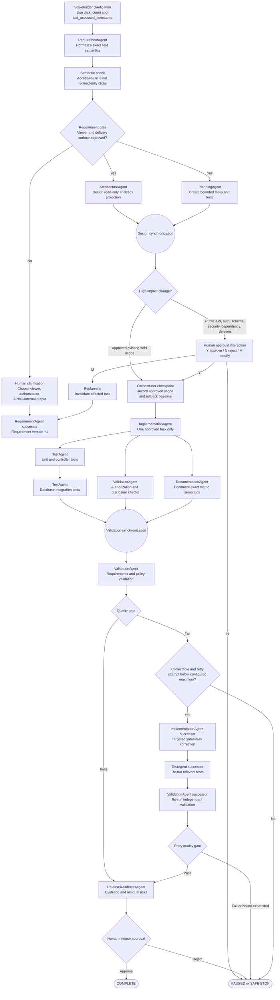
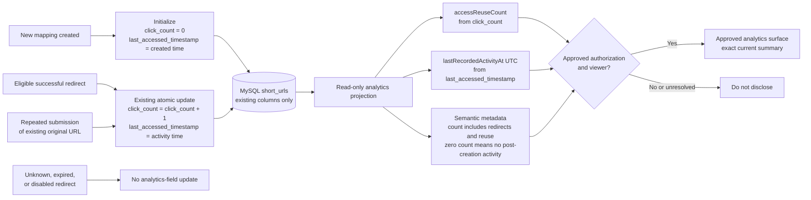

# Ambiguous Requirement Scenario: URL Analytics

## 1. Requirement Agent input

> Add analytics to the URL shortener.

## 2. Analysis status

`NEEDS_HUMAN_CLARIFICATION`

The statement names a capability area but does not identify its users, business questions, events, metrics, dimensions, access rules, accuracy, freshness, retention, privacy boundaries, or delivery surface.

The existing system has `click_count` and `last_accessed_timestamp`, but both successful redirects and repeated submissions of an already stored original URL update those fields. The current value is therefore an access/reuse count, not an unambiguous redirect-click metric.

This analysis does not authorize implementation, database or API changes, collection of personal data, installation of an analytics dependency, or use of a third-party analytics service.

## 3. Decision classification

| Classification | Meaning in this scenario |
|---|---|
| `SAFE ASSUMPTION` | Preserves current product contracts, security, privacy, or truthful reporting. It may be included in the partial normalized requirement. |
| `REVERSIBLE ASSUMPTION` | Can be changed later with limited effect if raw facts remain available. It is documented but not normalized as approved behavior. |
| `HUMAN APPROVAL REQUIRED` | Affects business meaning, stored data, public APIs, security, privacy, dependencies, cost, or operational commitments. Implementation must wait for an authorized decision. |

## 4. Ambiguity register

| ID | Ambiguity and possible interpretations | Engineering consequence | Risk of choosing incorrectly | Recommended interpretation | Human clarification mandatory? | Classification |
|---|---|---|---|---|---|---|
| ANA-AMB-01 | **Business objective.** Analytics could mean a total click count, link-performance reporting, operational monitoring, marketing attribution, abuse detection, or all of these. | Each objective requires different events, dimensions, consumers, storage, and validation. | Engineering may produce data that is technically correct but does not support the stakeholder's decisions. | Begin with explicitly defined link-performance questions; treat operational monitoring and abuse detection as separate capabilities. | Yes. | `HUMAN APPROVAL REQUIRED` |
| ANA-AMB-02 | **Meaning of a click.** It could mean every request, a successful redirect, a browser navigation, a human interaction, or one visit per person/session. | Determines where counting occurs and whether identity, bot detection, or deduplication is required. | Counts can be materially overstated or mislabeled. | Define a basic click as a successful redirect request; call unique-person or session metrics separate derived metrics. | Yes. | `HUMAN APPROVAL REQUIRED` |
| ANA-AMB-03 | **Existing counter semantics.** Repeated original-URL submissions currently increment `click_count`; they could remain included, be excluded prospectively, or be separated into a reuse metric. | May require service and persistence changes and creates a discontinuity in historical data. | Presenting the current value as clicks would produce misleading analytics. | Separate successful redirects from duplicate submissions; until then label the existing field as an access/reuse count. | Yes before changing behavior; no for truthful labeling. | `SAFE ASSUMPTION` |
| ANA-AMB-04 | **Which HTTP requests count.** `GET`, `HEAD`, crawler previews, retries, prefetches, and repeated requests may count differently. | Requires method filtering, request classification, or deduplication rules. | Link previews and automatic requests can inflate reported use. | Count only a request that follows the approved successful-redirect definition; report automated requests separately if detection is introduced. | Yes. | `HUMAN APPROVAL REQUIRED` |
| ANA-AMB-05 | **Failed resolutions.** Unknown, expired, disabled, malformed, or internally failed requests could be excluded, counted as clicks, or reported as separate failure events. | Changes event taxonomy and placement of instrumentation in the redirect path. | Combining failures with successful redirects corrupts conversion and use metrics. | Do not classify them as successful clicks; report them only as separately named operational events if approved. | No for excluding them from successful-click totals. | `SAFE ASSUMPTION` |
| ANA-AMB-06 | **Unique visitors.** Uniqueness could be based on IP address, cookie, account, device fingerprint, session, or not offered. | Introduces identity state, cookies, hashing, consent, and probabilistic calculations. | It may create personal data, regulatory obligations, inaccurate claims, or fingerprinting risk. | Do not implement unique-visitor analytics without a privacy-approved identity definition. | Yes. | `HUMAN APPROVAL REQUIRED` |
| ANA-AMB-07 | **Bot and fraud handling.** Bots could be included, excluded through heuristics, identified using a vendor, or shown separately. | Requires user-agent/IP analysis, rules, ongoing maintenance, and possibly external services. | Counts may be inflated; filtering may incorrectly remove legitimate traffic or create a false claim of accuracy. | Preserve observed request facts and label any bot-filtered metric as an estimate with a documented method. | Yes. | `HUMAN APPROVAL REQUIRED` |
| ANA-AMB-08 | **Metrics required.** Possible metrics include total redirects, last access, time series, unique visitors, referrers, geography, devices, browsers, conversions, and top links. | Metric selection determines event fields, aggregation jobs, indexes, APIs, and UI scope. | Collecting everything increases cost and privacy exposure; collecting too little may require a later redesign. | Approve a minimal metric catalog tied to named business questions before designing storage. | Yes. | `HUMAN APPROVAL REQUIRED` |
| ANA-AMB-09 | **Dimensions and granularity.** Reports could aggregate by minute, hour, day, country, referrer, device, campaign, or destination. | Determines cardinality, storage growth, query design, and privacy risk. | High-cardinality dimensions can degrade performance and enable re-identification. | Start with low-cardinality, non-personal dimensions only after each dimension has an approved purpose. | Yes. | `HUMAN APPROVAL REQUIRED` |
| ANA-AMB-10 | **Time semantics.** Reporting could use UTC, viewer-local time, link-owner time, fixed calendar periods, or rolling windows. | Affects bucketing, APIs, UI, tests, and daylight-saving behavior. | Users may see inconsistent totals at reporting boundaries. | Store event time in UTC and make any presentation timezone explicit. | No for UTC storage; presentation timezone may be clarified later. | `REVERSIBLE ASSUMPTION` |
| ANA-AMB-11 | **Analytics freshness.** Results could be synchronous, near-real-time, periodically batched, or daily. | Drives whether redirect requests write directly, publish events, or feed batch aggregation. | Strict freshness can increase redirect latency and availability coupling; batching may disappoint users expecting live data. | Prefer eventually consistent analytics with a published freshness target so redirects remain isolated. | Yes for the freshness target. | `HUMAN APPROVAL REQUIRED` |
| ANA-AMB-12 | **Accuracy and delivery guarantees.** Counts could be best effort, at-least-once, exactly-once, or reconciled later. | Determines transaction boundaries, idempotency keys, queues, and reconciliation. | Dropped or duplicated events may invalidate reports; strict guarantees may harm redirect availability. | Define an error tolerance and reconciliation policy rather than promising exact-once analytics by default. | Yes. | `HUMAN APPROVAL REQUIRED` |
| ANA-AMB-13 | **Redirect-path failure behavior.** Analytics failure could fail the redirect, delay it, retry asynchronously, or drop the event. | Determines coupling, timeout, queue, retry, and recovery design. | Failing redirects for analytics damages the primary service; silently dropping data damages trust. | Preserve redirect availability and record observable, bounded analytics-delivery failures for later reconciliation. | Yes for the accepted data-loss/error budget. | `HUMAN APPROVAL REQUIRED` |
| ANA-AMB-14 | **Performance objective.** No acceptable redirect latency overhead or analytics query latency is stated. | Engineering cannot size the design or define performance tests. | Instrumentation may degrade the primary redirect path or reports may be unusably slow. | Establish separate redirect-overhead and report-query objectives before implementation. | Yes. | `HUMAN APPROVAL REQUIRED` |
| ANA-AMB-15 | **Raw events versus aggregates.** The system could retain only counters, append one event per request, or keep both events and rollups. | Changes schema, volume, replay capability, correction options, and privacy impact. | Aggregates cannot answer later questions; raw events increase cost and sensitivity. | Store the least detailed data that satisfies approved metrics and retention needs. | Yes. | `HUMAN APPROVAL REQUIRED` |
| ANA-AMB-16 | **Data retention.** Analytics could be kept forever, for a fixed period, until link deletion, or in tiered storage. | Requires retention jobs, partitions, deletion workflows, backups, and capacity planning. | Indefinite retention creates privacy, legal, and cost exposure. | Define separate retention periods for raw events, aggregates, logs, and existing counters. | Yes. | `HUMAN APPROVAL REQUIRED` |
| ANA-AMB-17 | **Privacy and consent.** IP addresses, user agents, referrers, cookies, or identifiers could be stored raw, truncated, hashed, or not collected. | Introduces data classification, consent, notices, access controls, and erasure obligations. | Unapproved collection can violate privacy law or organizational policy; hashing may still leave personal data. | Collect no personal or linkable visitor data until privacy review explicitly approves each field and purpose. | Yes. | `HUMAN APPROVAL REQUIRED` |
| ANA-AMB-18 | **Geographic analytics.** Location could come from IP lookup, account data, browser input, or not be offered. | May require retaining or transmitting IP data and adding a geolocation database or vendor. | Location can be inaccurate, sensitive, costly, or legally restricted. | Omit geography from the initial safe scope unless privacy, accuracy, dependency, and retention decisions are approved. | Yes. | `HUMAN APPROVAL REQUIRED` |
| ANA-AMB-19 | **Referrer and campaign data.** The system could record full referrer URLs, origin-only values, query parameters, campaign IDs, or none. | Affects request capture, sanitization, cardinality, and storage. | Full URLs and query strings can leak tokens, personal data, or confidential page paths. | Do not store full referrer URLs or arbitrary query parameters; approve a sanitized allowlist if attribution is required. | Yes. | `HUMAN APPROVAL REQUIRED` |
| ANA-AMB-20 | **Who may view analytics.** Reports could be public, available through an unguessable token, restricted to link owners, or administrator-only. The current baseline has no account ownership model. | Requires authorization, ownership, credential, sharing, and audit design. | Public or weakly protected analytics can disclose traffic and business-sensitive information. | Do not expose analytics until an authenticated authorization and ownership model is approved. | Yes. | `HUMAN APPROVAL REQUIRED` |
| ANA-AMB-21 | **Delivery surface.** Analytics could be returned in existing create/metadata responses, exposed through a new API, shown in a React dashboard, exported as CSV, or sent by webhook. | Affects public contracts, frontend scope, authorization, pagination, and rate limits. | A guessed interface can break clients, expose data, or expand the assessment beyond its goal. | Define one separately authorized read contract before adding UI or export formats. | Yes. | `HUMAN APPROVAL REQUIRED` |
| ANA-AMB-22 | **Historical reporting.** Existing counters could be shown as historical clicks, reset, migrated as access/reuse data, or reporting could begin at launch. | Determines migration, labels, trend continuity, and initial values. | Historical charts may imply detail or accuracy that was never collected. | Start new metrics at a clearly recorded collection boundary and retain old counters under their truthful legacy definition. | Yes. | `HUMAN APPROVAL REQUIRED` |
| ANA-AMB-23 | **Disabled, expired, and deleted links.** Their prior analytics could remain visible, become hidden, be anonymized, or be deleted. | Couples lifecycle transitions to authorization, retention, and erasure jobs. | Removing reports can violate business expectations; retaining them can violate privacy or takedown requirements. | Define analytics retention independently from redirect eligibility, subject to deletion and legal policies. | Yes. | `HUMAN APPROVAL REQUIRED` |
| ANA-AMB-24 | **Database and architecture.** Analytics could extend the existing MySQL row, add event tables, use a queue and analytics store, or use an external platform. | Changes schema, transactions, infrastructure, operations, rollback, and cost. | Adding per-click writes to the transactional database can create contention; a new store expands operational burden. | Select architecture only after volume, metric, freshness, retention, and accuracy requirements are approved. | Yes; schema and infrastructure changes are high impact. | `HUMAN APPROVAL REQUIRED` |
| ANA-AMB-25 | **Third-party services and dependencies.** The system could use a hosted analytics product, geolocation provider, message broker, or only existing components. | Introduces procurement, data transfer, credentials, licenses, supply-chain risk, and availability dependencies. | Data may leave approved boundaries; cost and vendor lock-in may be accepted silently. | Use no new vendor or dependency without security, privacy, license, cost, and human approval. | Yes. | `HUMAN APPROVAL REQUIRED` |
| ANA-AMB-26 | **Security against enumeration and abuse.** Analytics queries could accept arbitrary short codes, reveal link existence, or return sensitive dimensions. | Requires authorization checks, rate limits, non-enumerable identifiers, and safe error behavior. | Attackers could discover private traffic patterns or use analytics endpoints for enumeration and denial of service. | Preserve non-disclosure for unknown, expired, and disabled codes; deny analytics access by default. | No for preserving current non-disclosure; yes for any new access model. | `SAFE ASSUMPTION` |
| ANA-AMB-27 | **Scale assumptions.** Expected redirects per second, number of links, events per day, report concurrency, and growth are unspecified. | Prevents capacity estimation, partitioning, index selection, and meaningful load tests. | The solution may work in tests but fail under actual traffic or cost too much for the assessment. | Obtain bounded volume and growth assumptions before selecting an event-storage design. | Yes. | `HUMAN APPROVAL REQUIRED` |
| ANA-AMB-28 | **Presentation and terminology.** The UI could call values clicks, visits, accesses, redirects, or engagements and could show exact or estimated values. | Affects documentation and user trust but can usually change without data migration. | Misleading names create false business conclusions even when collection is correct. | Use names that match the approved event definition and visibly label estimates and freshness. | No; wording remains subject to documentation validation. | `REVERSIBLE ASSUMPTION` |

## 5. Partial normalized requirement

Only decisions classified as safe assumptions are normalized below. This is a safety and integrity envelope, not an implementation-ready analytics feature.

### Objective

Provide truthful, access-controlled URL-usage information without changing URL-shortening or redirect outcomes, weakening link-state controls, or collecting unapproved visitor data.

### Functional requirements

| ID | Normalized requirement | Basis |
|---|---|---|
| ANA-FR-01 | The system shall not present the existing `click_count` as a redirect-only click total while duplicate original-URL submissions also increment it. | Preserves truthful metric semantics. |
| ANA-FR-02 | Unknown, expired, disabled, malformed, and internally failed resolutions shall not be classified as successful redirects. | Preserves the distinction between successful use and failure events. |
| ANA-FR-03 | Analytics behavior shall not change the destination, HTTP outcome, eligibility, expiration, or disabled status of a short URL. | Analytics is observational and does not own URL lifecycle behavior. |
| ANA-FR-04 | Analytics for unknown, expired, or disabled codes shall preserve the existing public non-disclosure behavior. | Prevents link enumeration and lifecycle-state leakage. |
| ANA-FR-05 | The system shall not expose link analytics until an approved authorization and ownership rule identifies who may access them. | Fails closed because the current anonymous model does not establish an analytics owner. |
| ANA-FR-06 | The system shall not collect unique-visitor identifiers, full referrer URLs, arbitrary query parameters, precise location, or other personal/linkable visitor data without explicit privacy approval. | Preserves data-minimization and privacy boundaries. |

### Non-functional and governance requirements

| ID | Normalized requirement | Basis |
|---|---|---|
| ANA-NFR-01 | Metric names, descriptions, timestamps, freshness, and estimated-versus-observed status shall accurately describe the approved collection semantics. | Prevents misleading reporting. |
| ANA-NFR-02 | Analytics shall not be represented as historically available before the recorded start of valid collection. | Prevents fabricated historical precision. |
| ANA-NFR-03 | No new database schema, public API, dependency, external service, or personal-data collection is authorized by this partial requirement. | Those choices are unresolved and high impact. |
| ANA-NFR-04 | Tests and documentation shall not claim click accuracy, uniqueness, bot exclusion, real-time freshness, or complete delivery unless those properties are defined and validated with evidence. | Prevents unsupported quality claims. |

## 6. Acceptance criteria for the safe subset

| ID | Acceptance criterion |
|---|---|
| ANA-AC-01 | Documentation and any existing metadata output describe the current count as including successful redirects and repeated existing-URL submissions, or avoid assigning it a narrower meaning. |
| ANA-AC-02 | Requests for unknown, expired, or disabled codes retain their existing public result and are not reported as successful redirects. |
| ANA-AC-03 | No analytics view or endpoint is made available without an approved access-control decision and corresponding authorization validation. |
| ANA-AC-04 | No newly collected analytics record contains an unapproved visitor identifier, full referrer URL, arbitrary query string, or precise geographic value. |
| ANA-AC-05 | Analytics documentation identifies the collection start boundary and does not infer unavailable historical detail from aggregate legacy counters. |

These criteria intentionally do not select metrics, create an endpoint or dashboard, define a database schema, choose a vendor, or specify a retention period.

## 7. Mandatory stakeholder decisions before implementation

The Requirement Agent must obtain and record human answers for at least:

1. The business questions analytics must answer and the users who will act on them.
2. The exact event and metric catalog, including the meaning of a click and handling of duplicate submissions, methods, bots, previews, retries, and failures.
3. Whether unique visitors, referrers, geography, device, campaign, or other dimensions are required.
4. The analytics viewer, ownership, authentication, authorization, and sharing model.
5. The delivery surface: API, dashboard, export, webhook, or another approved interface.
6. Freshness, consistency, accuracy/error tolerance, redirect latency overhead, and analytics query objectives.
7. Expected traffic, link count, event volume, report concurrency, and growth.
8. Raw-event, aggregate, log, backup, deletion, and privacy-retention periods.
9. Treatment of analytics after a link expires, is disabled, is deleted, or receives a legal/abuse takedown.
10. Historical cutover and truthful handling of the existing access/reuse counter.
11. The database or analytics architecture, migration, rollback, and failure-recovery strategy.
12. Whether any new dependency, message broker, geolocation database, or external analytics provider is approved.

Database schema changes, public API changes, authentication/authorization changes, external data transfer, and production configuration changes are `HIGH RISK` and require explicit human approval under the controlled-autonomy policy.

## 8. Requirement Agent result

```text
agentName: RequirementAgent
status: REQUIRES_HUMAN_APPROVAL
summary: A safe analytics integrity and privacy envelope was normalized, but the
         business metrics, access model, data design, retention, and service
         objectives remain unresolved.
implementationAuthorized: false
nextAction: Obtain the stakeholder decisions in Section 7, version the normalized
            requirement, and run the requirement gate again.
```

## 9. Stakeholder clarification: analytics data basis

The following clarification has been received:

> Analytics should be based on `click_count` and `last_accessed_timestamp`.

This resolves the initial data-source ambiguity but does not resolve who may view analytics or whether the delivery surface is an API, UI, export, or internal report. The Requirement Agent must preserve the existing field semantics instead of silently redefining them:

| Source field | Approved analytics meaning | Important limitation |
|---|---|---|
| `click_count` | `accessReuseCount`: cumulative successful redirects plus repeated submissions of an already stored original URL. | It is not a redirect-only click count, unique-visitor count, or human-click count. |
| `last_accessed_timestamp` | `lastRecordedActivityAt`: UTC time of the most recent successful redirect or repeated existing-URL submission. | It is initialized to creation time, so a link with count zero has no post-creation access even though the timestamp is populated. |

These fields can support a current cumulative activity summary. They cannot reconstruct individual events, trends by time period, unique users, referrers, geography, devices, bots, or historical click sequences.

## 10. Agentic process flow



The `RA2` node is a versioned successor requirement, not a backward mutation of the original workflow node. Implementation, test, and validation agents contain no retry loops; the orchestrator creates at most the configured number of successor attempts.

## 11. Analytics data flow



This flow does not add event storage or modify the existing atomic update path. If a future requirement needs redirect-only clicks or historical trends, the Requirement Agent must create a new requirement version because the current aggregate fields cannot supply that information retrospectively.

## 12. Process agents must follow

| Step | Owner | Required action | Entry condition | Exit evidence | Prohibited shortcut |
|---|---|---|---|---|---|
| ANA-P01 | `RequirementAgent` | Normalize `click_count` as access/reuse count and `last_accessed_timestamp` as last recorded activity; record remaining viewer and delivery ambiguities. | Stakeholder clarification is recorded. | Versioned requirements, metric dictionary, exclusions, and acceptance criteria. | Calling the values redirect-only clicks, unique visitors, or a time series. |
| ANA-P02 | Requirement gate and human reviewer | Approve the analytics consumer, authorization rule, delivery surface, and exact labels. | ANA-P01 is complete. | Approval references the exact requirement version and scope. | Treating the data source clarification as approval for a public endpoint. |
| ANA-P03 | `ArchitectureAgent` and `PlanningAgent`, in parallel | Propose a read-only projection and create bounded implementation/test/documentation tasks using the existing columns. | Requirement gate passed. | Compatible design, dependency graph, affected-file proposal, performance risks, and rollback approach. | Adding schema, identity tracking, raw events, dependencies, or external services without approval. |
| ANA-P04 | Design synchronization and policy engine | Confirm architecture and plan use the same requirement version; classify every operation. | Architecture and planning completed. | Synchronized design and controlled-autonomy decisions. | Allowing an agent prohibition to be overridden by approval. |
| ANA-P05 | Human approver when required | Review public API, authentication/authorization, security, database, dependency, or production-configuration changes using Y/N/M interaction. | A high-risk operation was identified. | Scoped approval, rejection, or modification instructions in workflow audit. | Agent self-approval or approval inferred from silence. |
| ANA-P06 | Orchestrator | Capture a known-good checkpoint and invoke one approved implementation task. | Design and required approval are current. | Checkpoint, task scope, file hashes, and invocation audit. | Starting unrelated work or expanding the requirement. |
| ANA-P07 | `ImplementationAgent` | Implement only the approved read behavior and map the two persisted values without changing their update semantics. | Checkpoint and task inputs are current. | Changed files, result artifact, decisions, risks, and validation obligations. | Changing the database schema, counter update triggers, redirect behavior, or public contract without approval. |
| ANA-P08 | `TestAgent` | Verify field mapping, zero-count semantics, UTC timestamp handling, read-only behavior, lifecycle non-disclosure, and approved controller behavior. | Implementation result exists. | Actually executed unit, controller, concurrency-regression, and integration-test evidence. | Inventing historical events or claiming a test passed without execution. |
| ANA-P09 | `ValidationAgent` | Independently verify requirements traceability, truthful labels, authorization, privacy boundaries, unchanged redirect behavior, and test evidence. | Test and implementation evidence are complete. | Pass/fail findings with severity and remediation scope. | Waiving a critical security or privacy finding. |
| ANA-P10 | Orchestrator | On a correctable implementation failure, preserve failure context and run the bounded Implementation -> Test -> Validation successor attempt. | Failure is retryable and within configured bound. | Retry history and recovery metrics, or `SAFE_STOP` after exhaustion. | Retrying missing approval, ambiguity, security violations, destructive work, or critical findings. |
| ANA-P11 | `DocumentationAgent` | Document field provenance, exact semantics, timestamp behavior, access restrictions, limitations, and collection boundary. | Approved requirements and implementation evidence exist. | Documentation traceable to the implementation and validation results. | Describing access/reuse count as unique or redirect-only clicks. |
| ANA-P12 | `ReleaseReadinessAgent` and human release owner | Assemble evidence, verify residual risks and rollback readiness, then approve or reject release readiness. | Quality gate passed. | Release decision and immutable audit trail. | Deploying or declaring completion without human release approval. |

## 13. Clarified partial requirements

The following requirements normalize only the newly clarified field basis and the previously safe constraints. They still do not authorize a public analytics interface.

| ID | Requirement |
|---|---|
| ANA-CLR-FR-01 | The analytics summary shall source its cumulative activity value from the existing `click_count` field without recalculating or silently changing that field. |
| ANA-CLR-FR-02 | The analytics summary shall expose the `click_count` value with semantics that explicitly include successful redirects and repeated submissions of an existing original URL. |
| ANA-CLR-FR-03 | The analytics summary shall source its latest activity time from the existing `last_accessed_timestamp` field and identify it as UTC. |
| ANA-CLR-FR-04 | When `click_count` is zero, the system shall not claim that `last_accessed_timestamp` proves a redirect or repeat submission occurred, because the timestamp is initialized at creation. |
| ANA-CLR-FR-05 | Reading an analytics summary shall not increment `click_count`, update `last_accessed_timestamp`, or otherwise mutate the short URL. |
| ANA-CLR-FR-06 | The summary shall not derive event history, time-series trends, unique visitors, referrers, geography, device data, or bot classification from these two aggregate fields. |
| ANA-CLR-FR-07 | Unknown, expired, or disabled code handling and successful redirect behavior shall remain unchanged. |
| ANA-CLR-NFR-01 | Any approved analytics read path shall preserve the redirect path's existing concurrency-safe atomic updates. |
| ANA-CLR-NFR-02 | Metric labels and documentation shall distinguish observed stored values from unavailable or estimated analytics. |

## 14. Acceptance criteria for the clarified field basis

| ID | Acceptance criterion |
|---|---|
| ANA-CLR-AC-01 | Given an authorized mapping with `click_count = 7`, the approved analytics projection reports an access/reuse count of exactly `7`. |
| ANA-CLR-AC-02 | Given `last_accessed_timestamp = 2026-08-20T10:37:31Z`, the approved projection reports that exact instant as the last recorded activity time in UTC. |
| ANA-CLR-AC-03 | Reading the projection leaves both persisted fields unchanged. |
| ANA-CLR-AC-04 | After one successful eligible redirect, the existing atomic update increments the count once and refreshes the timestamp; the projection reflects the stored result. |
| ANA-CLR-AC-05 | After one repeated submission of an existing original URL, the existing atomic update increments the same count and refreshes the timestamp; the projection does not label the activity as necessarily being a redirect click. |
| ANA-CLR-AC-06 | Unknown, expired, and disabled redirect attempts neither update these fields nor appear as successful activity. |
| ANA-CLR-AC-07 | With count zero and a timestamp equal to creation time, the projection states that no counted post-creation activity has occurred. |
| ANA-CLR-AC-08 | No analytics output is disclosed while its viewer and authorization rule remain unresolved. |

## 15. Updated Requirement Agent result

```text
agentName: RequirementAgent
status: REQUIRES_HUMAN_APPROVAL
summary: The existing analytics data source and its truthful metric semantics are
         normalized. Viewer, authorization, and delivery-surface decisions remain open.
implementationAuthorized: false
nextAction: Approve the analytics viewer, authorization rule, delivery surface,
            performance target, and retention policy at the requirement gate.
```
