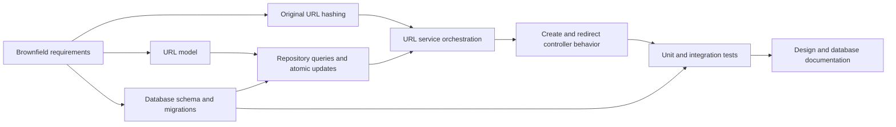
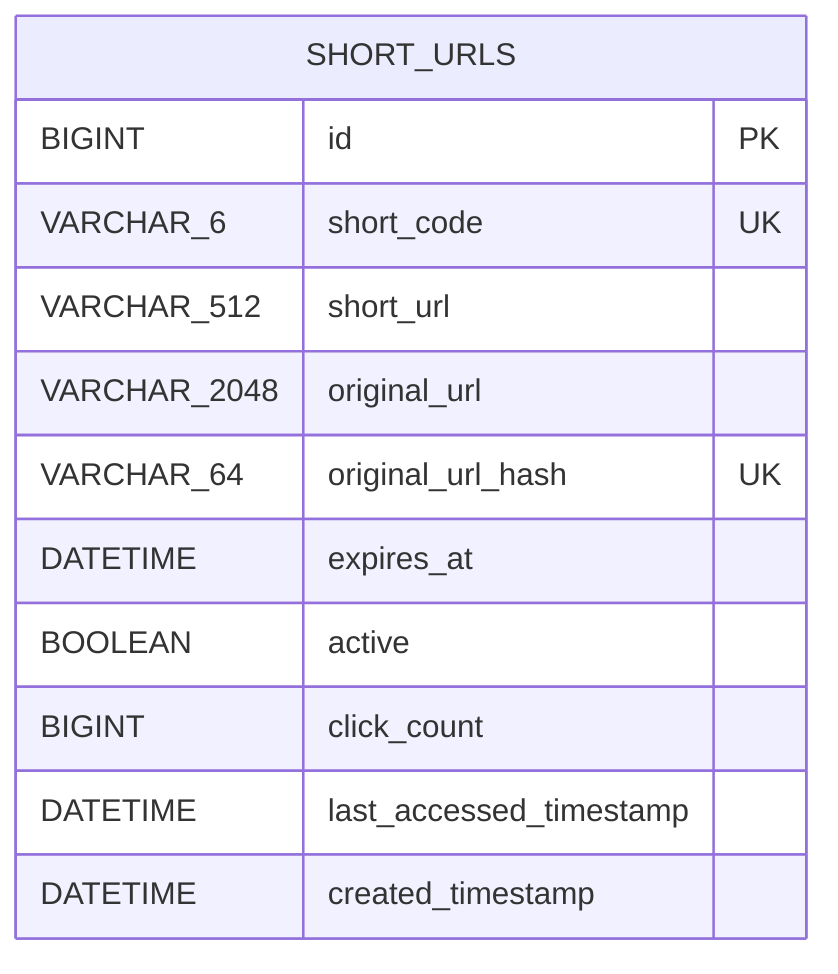
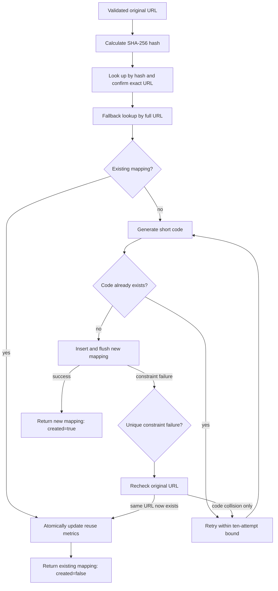
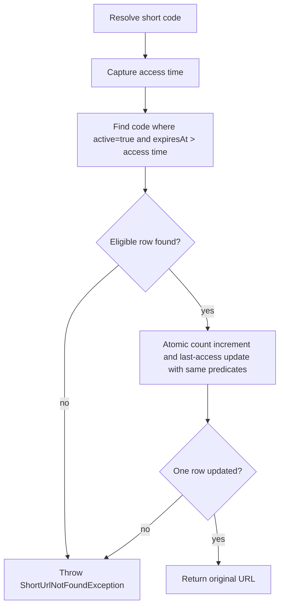

# Brownfield Scenario: Duplicate Prevention, Expiration, and URL Hit Counting

## 1. Scenario purpose

The work began with an existing API, domain model, database table, service, controller, tests, and published behavior that had to remain compatible.

## 2. Change request

Enhance the existing URL shortener so that it:

1. Reuses an existing mapping when the same original URL is submitted again.
2. Prevents duplicate original-URL rows, including under concurrent requests.
3. Expires new links after one calendar month.
4. Allows a link to be disabled through its model state.
5. Rejects redirects for expired or disabled links.
6. Records URL access count and last-access time.
7. Evolves the existing database safely rather than rebuilding it.

## 3. Requirement interpretation

### 3.1 Duplicate entry

“Duplicate” was interpreted as exact string equality after validation. The application does not canonicalize hostname case, trailing slashes, default ports, fragments, or query-parameter order.

Expected behavior:

- A new original URL creates one row and returns `201 Created`.
- A later submission of the exact same string returns the stored mapping and `200 OK`.
- The second request does not generate a new short code or insert another row.
- Concurrent requests for the same original URL converge on the row that wins the database uniqueness race.

### 3.2 Expiration and disabled links

Expiration was interpreted as one UTC calendar month after creation, not a fixed number of seconds. A redirect candidate must be active and have an expiration time strictly later than the access time.

Expired, disabled, and unknown codes intentionally share the same public outcome:

```text
404 SHORT_URL_NOT_FOUND
```

This avoids exposing whether a code previously existed or was administratively disabled.

### 3.3 URL hit count

The change added `click_count` and `last_accessed_timestamp`. In the implemented behavior, both of the following increment the count:

- A successful short-code redirect.
- Re-submission of an original URL that already has a mapping.

Therefore, the field is technically an access/reuse counter rather than a redirect-only click counter. A requirement decision would be needed before treating it as a precise analytics metric.

## 4. Impact analysis



| Area | Baseline behavior | Brownfield impact |
|---|---|---|
| URL model | Code, short URL, original URL, and creation time only | Add original-URL hash, expiry, active state, count, and last-access time |
| Database | Hibernate-created table; uniqueness only on short code | Add hash uniqueness, lifecycle fields, metrics, index, check constraint, and versioned migrations |
| Repository | Code existence and code lookup | Add duplicate lookups, eligible-redirect query, and atomic metric updates |
| URL service | Always create a new row; resolve by code | Reuse duplicates, handle concurrent uniqueness races, enforce lifecycle, and update metrics |
| Controller | Create always returns `201`; redirect delegates lookup | Create returns `201` or `200`; redirect contract stays `302/404` while service rules become stricter |
| Tests | 13 tests for the original MVP | Expand to 19 tests covering reuse, lifecycle, metrics, and state races |
| Documentation | General system design and ADRs | Update behavior and ADRs; add a dedicated database-design document |

## 5. URL model

### 5.1 Before

```text
ShortUrl
├── id
├── shortCode
├── shortUrl
├── originalUrl
└── createdTimestamp
```

### 5.2 After

```text
ShortUrl
├── id
├── shortCode
├── shortUrl
├── originalUrl
├── originalUrlHash
├── expiresAt
├── active
├── clickCount
├── lastAccessedTimestamp
└── createdTimestamp
```

### 5.3 New model rules

| Field | Rule introduced by the brownfield change |
|---|---|
| `originalUrlHash` | SHA-256 hexadecimal value used as a fixed-width lookup and uniqueness key; nullable for legacy compatibility |
| `expiresAt` | Creation time plus one UTC calendar month |
| `active` | Initialized to `true`; inactive links cannot redirect |
| `clickCount` | Initialized to zero and incremented atomically on successful access/reuse decisions |
| `lastAccessedTimestamp` | Initialized to the creation time and refreshed with the access/reuse time |

The model also gained `deactivate()` and `setExpiresAt(...)` methods to support lifecycle tests and future administrative behavior. No administrative HTTP endpoint was added in these commits.

## 6. Database schema

### 6.1 Resulting table



### 6.2 Schema protections

- `short_code` remains unique and uses ASCII binary collation so Base62 codes are case-sensitive.
- `original_url_hash` is unique and uses ASCII binary collation.
- `click_count` defaults to zero and has a nonnegative check constraint.
- `(active, expires_at)` has an index supporting lifecycle filtering.
- Identity `id` remains the primary key.

The service verifies the complete original URL after a hash lookup. This prevents a theoretical hash collision from returning the wrong mapping, although the unique hash constraint could still prevent insertion of the colliding URL.

### 6.3 Migration sequence

The brownfield change replaced Hibernate schema mutation with Flyway migrations and changed Hibernate to schema validation.

| Migration | Responsibility |
|---|---|
| `V1__create_short_urls.sql` | Define the controlled base table, short-code uniqueness, and nullable original-URL hash uniqueness. |
| `V2__add_link_lifecycle_and_metrics.sql` | Add nullable expiry and last-access fields, active state, click count, nonnegative constraint, and lifecycle index. |
| `V3__backfill_link_timestamps.sql` | Populate legacy rows from `created_timestamp`, then make expiry and last-access fields non-null. |

Adding nullable columns before backfilling and tightening nullability allowed existing rows to survive the schema evolution. Legacy records without a URL hash remained supported by service fallback lookup on the full original URL.

## 7. URL service

### 7.1 Duplicate-aware creation flow



Key service changes:

- `OriginalUrlHasher` calculates the SHA-256 key.
- `findExisting(...)` first checks the hash and confirms exact string equality.
- Full-URL lookup provides backward compatibility for pre-hash rows.
- `ShortUrlCreationResult` carries both the response and whether a row was created.
- Database uniqueness remains the final authority for concurrent duplicate requests.
- Ordinary code collision handling and the ten-attempt retry bound remain intact.

### 7.2 Lifecycle-aware redirect flow



Repeating the active and expiry predicates in the atomic update closes the time-of-check/time-of-use window: if the link changes state between lookup and update, the service refuses to redirect.

## 8. Redirect controller

The redirect endpoint remained:

```http
GET /{shortCode}
```

The controller itself did not need lifecycle or counter logic. It continued to:

1. Delegate resolution to `ShortUrlService`.
2. Return `302 Found` with the resolved URL in `Location` when the service succeeds.
3. Rely on global exception handling to return `404 SHORT_URL_NOT_FOUND` when the service rejects an unknown, expired, disabled, or state-raced link.

Keeping lifecycle decisions in the service avoided putting business and persistence logic in the HTTP layer.

The create endpoint did change during duplicate prevention:

| Service result | HTTP response |
|---|---|
| New row, `created=true` | `201 Created` |
| Existing mapping, `created=false` | `200 OK` |

## 9. Tests

The two brownfield increments expanded the original 13-test backend suite to 19 tests.

### 9.1 Unit tests

Added or extended service assertions covered:

- New records initialize expiry, active state, zero count, and last-access time correctly.
- An existing exact URL returns its stored mapping without code generation or insertion.
- An existing mapping receives an access/reuse metric update.
- A concurrent original-URL insert returns the winning mapping.
- A short-code uniqueness race still retries with another code.
- Successful resolution invokes the atomic access update.
- A link that becomes ineligible between lookup and update is rejected.

### 9.2 Integration tests

Added or extended endpoint/database assertions covered:

- Repeated POST returns the same code with `200 OK` and leaves one database row.
- A new row has the expected one-month expiry, active state, zero count, and initial last-access time.
- Reusing an existing mapping increments its count and refreshes last access.
- A successful redirect increments its count and refreshes last access.
- An inactive code returns `404`.
- An expired code returns `404`.
- Existing invalid-input and unknown-code behavior remains intact.

### 9.3 Test gaps at this brownfield point

- Concurrent redirects were not yet tested for lost count updates.
- Tests used H2 compatibility mode rather than a real MySQL container.
- There was no test for an actual database outage during lookup or metric update.
- There was no public API for reading analytics, disabling links, or changing expiry.
- Exact URL comparison variations were not parameterized or canonicalized.

These gaps were not silently treated as completed behavior.

## 10. Compatibility and risk controls

| Risk | Control introduced |
|---|---|
| Duplicate rows from repeated requests | Hash lookup plus unique database constraint |
| Concurrent creation of the same URL | Catch uniqueness failure, re-read, and return the winning mapping |
| Short-code collision | Preliminary check, database constraint, and bounded retry |
| Existing rows lack lifecycle timestamps | Nullable-add, backfill, then non-null migration sequence |
| Existing rows lack URL hashes | Full-original-URL fallback lookup |
| Redirect of expired or disabled link | Eligibility query plus guarded atomic update |
| Lost count increment under concurrency | Database-side `click_count = click_count + 1` update |
| Case-insensitive database comparison of Base62 codes | ASCII binary collation |
| Unreviewed runtime schema changes | Flyway migrations and Hibernate `ddl-auto: validate` |

## 11. Release-readiness assessment

The brownfield change was ready for local prototype review when:

- Existing create and redirect contracts still passed.
- Duplicate submissions converged on one stored mapping.
- New rows received lifecycle and metric defaults.
- Expired and disabled links returned the same safe `404` response as unknown links.
- Metric updates were atomic and a failed guarded update prevented redirect.
- Flyway could establish and evolve the schema while Hibernate validated it.
- The expanded 19-test suite passed.
- README, architecture decisions, system design, and database design reflected the new behavior.

Remaining approval questions included whether repeat POSTs should count as clicks, whether one-month expiry should be configurable, how links would be disabled operationally, how analytics would be queried, and what production availability and retention targets applied.
