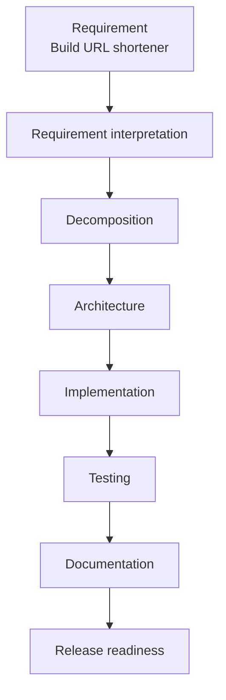
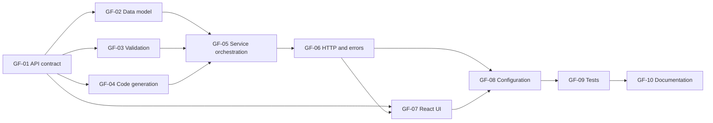
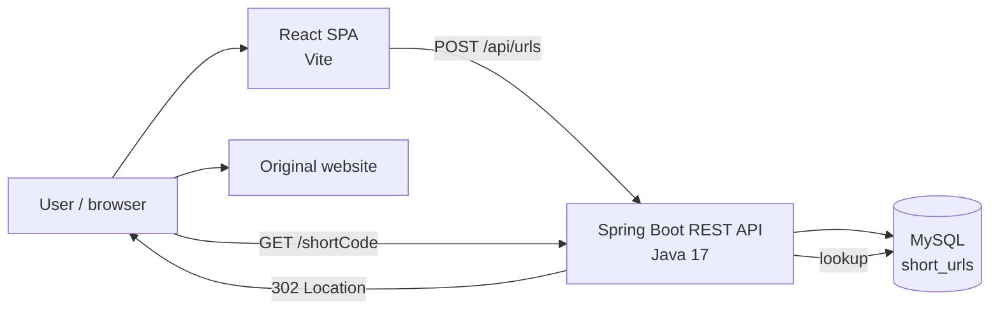
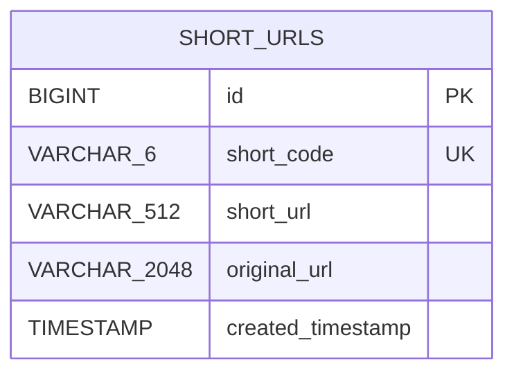

# Greenfield Scenario: Initial URL Shortener

## 1. Scenario purpose

Build URL shortener.

## 2. Lifecycle overview

## 3. Requirement

> Build a URL shortener.

The statement identifies the product category but does not define its actors, API, user interface, persistence, short-code rules, availability targets, analytics, security controls, or deployment environment.

## 4. Requirement interpretation

### 4.1 Interpreted objective

Build a minimal full-stack service that accepts an absolute HTTP or HTTPS URL, creates a compact public URL, persists the mapping, and redirects a visitor from that short URL to the original destination.

### 4.2 Minimum user journeys

1. A user enters a long URL in a browser interface.
2. The system validates the URL and returns a short URL.
3. A visitor requests the short URL.
4. The system looks up the mapping and responds with an HTTP redirect.

### 4.3 Assumptions embodied by the first commit

These were implementation assumptions, not details supplied by the one-line requirement:

- The service is public and anonymous; it has no accounts or ownership model.
- Only absolute `http` and `https` destinations are accepted.
- A short code is six alphanumeric characters generated randomly.
- A successful create request returns `201 Created`.
- A successful resolution returns `302 Found`.
- Each create request may create a new mapping even when the original URL was previously shortened.
- MySQL is the runtime system of record.
- The first delivery is a synchronous, single-region prototype.
- The frontend and backend run as separate processes.

### 4.4 Explicitly excluded from the initial scenario

The following capabilities were not present in the first commit and must not be attributed to the greenfield baseline:

- Duplicate-original-URL detection or URL hashing.
- Link expiration, activation, disabling, or deletion.
- Click counts, last-access timestamps, or analytics.
- Flyway migrations.
- Custom aliases.
- Authentication, private links, or administration.
- Rate limiting, malicious-destination screening, or abuse controls.
- Distributed caching, multi-region operation, or formal service-level objectives.

## 5. Decomposition

The interpreted requirement was decomposed into the following work packages.

| ID | Work package | Depends on | Exit evidence in first commit |
|---|---|---|---|
| GF-01 | Define create and redirect API contracts. | Requirement interpretation | Request/response DTOs and controller mappings |
| GF-02 | Define the minimal persistent URL mapping. | GF-01 | `ShortUrl` entity and `ShortUrlRepository` |
| GF-03 | Validate submitted destination URLs. | GF-01 | `UrlValidator` accepting only absolute HTTP/HTTPS URLs |
| GF-04 | Generate unpredictable short codes. | GF-01 | `ShortCodeGenerator` using `SecureRandom` and an alphanumeric alphabet |
| GF-05 | Orchestrate creation, collision handling, persistence, and lookup. | GF-02, GF-03, GF-04 | `ShortUrlService` |
| GF-06 | Expose the backend HTTP interface and consistent errors. | GF-05 | `ShortUrlController` and `GlobalExceptionHandler` |
| GF-07 | Build the browser submission experience. | GF-01, GF-06 | React form, API call, result display, and copy action |
| GF-08 | Externalize database, public URL, API URL, and CORS configuration. | GF-06, GF-07 | Backend properties, environment variables, and frontend environment example |
| GF-09 | Verify business and HTTP behavior. | GF-03 through GF-08 | Unit and Spring integration tests |
| GF-10 | Document design, setup, trade-offs, and limitations. | GF-01 through GF-09 | README, system design, and architecture decisions |

The main dependency shape was not purely linear: URL validation, code generation, persistence modeling, and frontend work could proceed independently after the API contract was understood, then synchronize at service, controller, and integration testing.

## 6. Architecture

### 6.1 System context

### 6.2 Backend responsibilities

| Component | Initial responsibility |
|---|---|
| `ShortUrlController` | Map create and redirect HTTP requests to service operations. |
| `ShortUrlService` | Validate, generate a code, handle collisions, persist mappings, and resolve codes. |
| `UrlValidator` | Permit only absolute HTTP and HTTPS URLs with a host. |
| `ShortCodeGenerator` | Generate six-character alphanumeric values with `SecureRandom`. |
| `ShortUrlRepository` | Check code existence, persist mappings, and find a mapping by code. |
| `GlobalExceptionHandler` | Convert known and unexpected exceptions into a consistent JSON error shape. |

The backend was stateless outside the database and separated HTTP, business, validation, generation, and persistence concerns.

### 6.3 Simple initial database

The first commit contained one table, one entity, no relationships, and no analytics or lifecycle state.

| Column | Initial rule | Purpose |
|---|---|---|
| `id` | Identity primary key | Internal row identity |
| `short_code` | Required, six characters, unique | Public lookup key |
| `short_url` | Required, maximum 512 characters | Complete public URL returned to the caller |
| `original_url` | Required, maximum 2,048 characters | Redirect destination |
| `created_timestamp` | Required and immutable | UTC creation time |

The only business uniqueness constraint was `short_code`. The application performed a preliminary existence query, while the database unique constraint remained the final concurrency authority. Hibernate used `ddl-auto: update`; there were no versioned migration scripts in this baseline.

## 7. Implementation outcome

### 7.1 Create flow

1. Receive `POST /api/urls` with `originalUrl`.
2. Reject a missing, relative, malformed, or non-HTTP(S) URL.
3. Generate a six-character code.
4. Check whether the code already exists.
5. Build the public short URL from the configured base URL.
6. Insert the mapping into MySQL.
7. If a concurrent unique-code collision occurs, retry with a new code.
8. Stop after ten failed generation attempts and return a conflict error.
9. Return `201 Created` with the short code, short URL, and original URL.

### 7.2 Redirect flow

1. Receive `GET /{shortCode}`.
2. Query the database by the unique code.
3. Return `404 SHORT_URL_NOT_FOUND` when no mapping exists.
4. Otherwise, return `302 Found` with the original URL in the `Location` header.

### 7.3 Frontend outcome

The React interface provided long-URL entry, submission progress, error feedback, short-link display, and clipboard copy behavior. Its backend base URL was externally configurable.

## 8. Testing

The first commit recorded 13 backend tests using JUnit 5, Mockito, Spring Boot Test, MockMvc, and an isolated H2 database in MySQL compatibility mode.

| Test level | Count | Initial coverage |
|---|---:|---|
| Generator unit | 2 | Six-character alphanumeric format and output variation |
| Service unit | 7 | Creation, invalid URL, lookup, missing code, ordinary collision, concurrent insert collision, and bounded retry exhaustion |
| API integration | 4 | Persisted creation, invalid POST, successful redirect, and unknown-code response |

Validation gates represented by the initial suite:

- Generated codes match the required format.
- Valid creation persists a retrievable mapping.
- Invalid destinations are rejected.
- Known codes redirect to the correct URL.
- Unknown codes return the documented error.
- Collision handling terminates safely and does not overwrite an existing code.

The initial test approach did not verify a real MySQL instance, browser behavior, load, security abuse cases, or distributed concurrency.

## 9. Documentation

- A README with prerequisites, configuration, startup commands, API examples, and build commands.
- A system-design document covering components, data model, flows, configuration, quality attributes, tests, limitations, and evolution paths.
- Architecture decision records for frontend/backend separation, backend layering, REST and redirect semantics, code generation, collision handling, MySQL/H2 usage, timestamp handling, centralized errors, externalized configuration, and synchronous stateless execution.

This documentation made the initial design reviewable while keeping later improvements visibly outside the baseline.

## 10. Release readiness

### 10.1 Prototype release gates

| Gate | Evidence | Initial assessment |
|---|---|---|
| Requirement coverage | Create and redirect journeys exist end to end. | Met for the interpreted MVP |
| Buildability | Maven and npm build instructions are documented. | Documented; execution evidence is not stored in the commit |
| Automated verification | Thirteen backend tests cover core service and API paths. | Met for prototype scope |
| Persistence integrity | Unique constraint and bounded retry protect short-code ownership. | Met for single-database prototype |
| Configuration | Database credentials, public base URL, API URL, and CORS origin are externalized. | Met for local deployment |
| Operational documentation | Setup, API examples, architecture, risks, and limitations are documented. | Met |
| Human approval | No approval artifact exists in the first commit. | Not evidenced |

### 10.2 Residual risks accepted for the prototype

- Repeated submissions of the same original URL create independent mappings.
- Hibernate mutates the schema directly; migrations are not reviewable or repeatable.
- No analytics, expiration, disablement, ownership, or administrative controls exist.
- No rate limiting, destination reputation checking, or HTTPS enforcement exists.
- No health, metrics, tracing, or production alerting endpoints exist.
- H2 tests do not prove MySQL-specific collation and transaction behavior.
- The complete public short URL is stored, so a later hostname change does not update existing rows.

### 10.3 Readiness conclusion

The first commit was suitable as a reviewable local greenfield prototype for the two core URL-shortener journeys. It was not production-ready for public internet exposure. Advancing beyond prototype status required human approval of the unresolved product behavior, security controls, database migration strategy, observability, and quantitative reliability targets.
